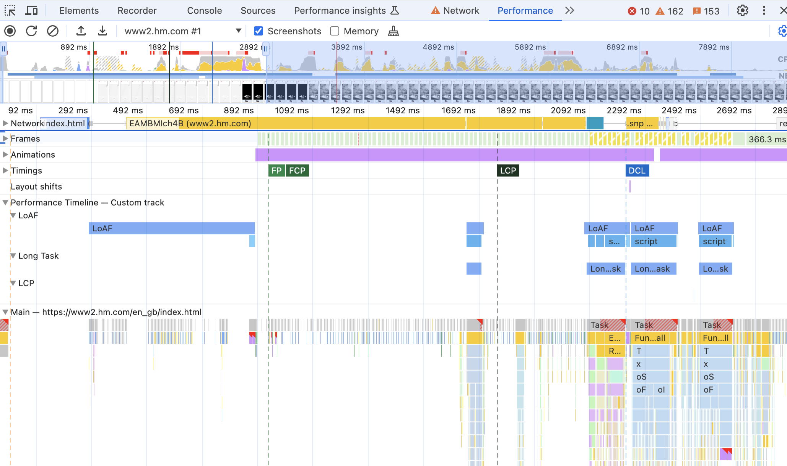

# perf-timeline-to-devtools-profile
Chrome Extension that creates a custom track in the DevTools Performance Panel populated with entries from the Performance Timeline

Originally created to help visualise the LoAF entries in the context of a Chrome Trace

Registers Performance Observers for the following Events and adds performance.marks / measures anotated with data for DevTools
- LoAF
- LoAF Scripts
- Long Tasks
- LCP
- INP

## Usage

Clone the repo, load as an unpacked extension in Chrome and then profile a page using the performance panel

## Example Output




## Notes

There are some good reasons [why a script that contributes to a LoAF might not have attribution details](https://developer.chrome.com/docs/web-platform/long-animation-frames#script-attribution) but if you notice a main thread task that you think is missing a script attribution it's worth raising it with the Chrome team.

There are a few issues around this that have already been raised and / or fixed:

- LoAF doesn't currently attibute time spent in extension code, but there's a [spec issue that discusses that](https://github.com/w3c/long-animation-frames/issues/10)
- There's a Chrome bug that's fixed in M133 where [Promise resolvers weren't attributed when there was a render already scheduled](https://issues.chromium.org/issues/378896421)

Available DevTools colours and payload types are:

```
type DevToolsColor =
  "primary" | "primary-light" | "primary-dark" |
  "secondary" | "secondary-light" | "secondary-dark" |
  "tertiary" | "tertiary-light" | "tertiary-dark" |
  "error";

interface ExtensionTrackEntryPayload {
  dataType?: "track-entry"; // Defaults to "track-entry"
  color?: DevToolsColor;    // Defaults to "primary"
  track: string;            // Required: Name of the custom track
  trackGroup?: string;      // Optional: Group for organizing tracks
  properties?: [string, string][]; // Key-value pairs for detailed view
  tooltipText?: string;     // Short description for tooltip
}

interface ExtensionMarkerPayload {
  dataType: "marker";       // Required: Identifies as a marker
  color?: DevToolsColor;    // Defaults to "primary"
  properties?: [string, string][]; // Key-value pairs for detailed view
  tooltipText?: string;     // Short description for tooltip
}
```

